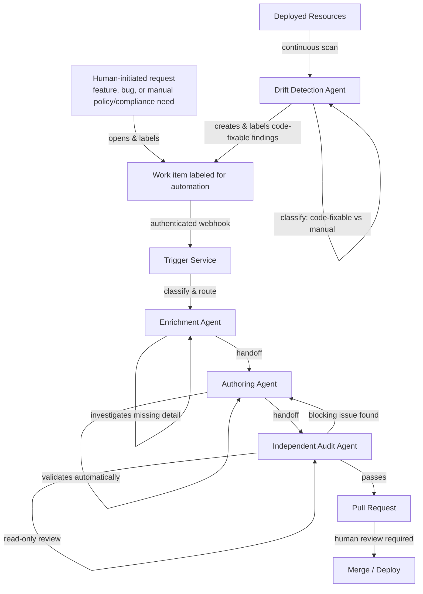

# A2A IaC Security — Agent-to-Agent Cloud Infrastructure Security Pipeline

> **In plain terms:** Companies run their computer systems on cloud services like Microsoft Azure. A single misconfigured setting in that cloud environment — the kind of small mistake that's easy to make and easy to miss — is one of the most common ways real security breaches happen. This project is a system of coordinated AI agents that automatically checks every proposed change to a company's cloud setup *before* it goes live, and separately keeps checking everything already running *after* it's deployed, flagging problems and suggesting fixes. A human still has to approve every change before anything happens — the agents assist and verify, they don't act unsupervised. The technical documentation below is written for engineers; this paragraph is the plain-language summary of what the rest of this page describes in detail.

A reference architecture for securing cloud infrastructure across its full lifecycle using coordinated, purpose-built AI agents — validating proposed infrastructure-as-code changes before they reach production, and continuously monitoring deployed resources for configuration drift afterward.

This repository documents the pattern, not a specific deployment. It is generic and organization-agnostic by design: every identifier, naming convention, and configuration value is a placeholder you supply. Nothing here is tied to any employer, client, or environment.

## Why this exists

Cloud misconfiguration is one of the most common technical causes of security incidents today, and the pace of infrastructure change in most organizations has outstripped the pace of manual security review. The usual response is either to slow deployments down with manual gates, or to accept the risk and rely on periodic audits. This project explores a third option: making the review itself fast, consistent, and automatic, without removing human judgment from the decisions that actually matter.

The core idea is simple to state and harder to build correctly: **an AI agent that proposes an infrastructure change should never be the same agent that approves it.** That separation of duties — enforced architecturally, not just by convention — is the foundation everything else in this repository builds on.

## Architecture



**Pre-deployment pipeline:**
1. **Trigger** — An authenticated webhook, filtered to a specific label, starts the pipeline. The originating work item can come from anywhere — a developer's own request, a bug report, a manually identified policy or compliance requirement, or an automated finding from the drift detection agent (stage 6) — the trigger treats all of them identically. Nothing runs on unlabeled or unauthenticated events.
2. **Enrichment** — An agent scores the incoming request for completeness and independently investigates anything missing, rather than guessing.
3. **Authoring** — A separate agent drafts the infrastructure code against a canonical template, validating every draft automatically.
4. **Independent audit** — A third agent, architecturally restricted to read-only access, reviews the change from the branch itself — never from the authoring agent's own account of its work.
5. **Human-gated merge** — Every change requires human approval. No agent can deploy anything unsupervised.

**Post-deployment pipeline:**
6. **Drift detection** — A separate agent continuously evaluates deployed resources against security benchmarks, classifies findings by remediation pathway, and creates structured work items with suggested fixes — feeding back into the same pipeline.

## Design principles

- **Separation of duties is architectural, not procedural.** The audit agent's tooling literally does not include a write capability. This isn't a policy someone could accidentally violate — it's not physically possible for that agent to do.
- **Policy as configuration, not code.** Every organization's specific security and compliance rules are supplied as parameters. The same pipeline enforces a different organization's rules without any change to the underlying system.
- **No standing trust.** Every credential is scoped to a managed identity; nothing is shared, nothing is long-lived. The webhook itself validates a secret before anything downstream even runs.
- **Independent verification, not self-reported status.** The trigger service checks its own completion state rather than trusting an agent's self-reported "done."
- **A human is always the last gate.** Automation earns trust by being verifiable, not by being unsupervised.

## Repository structure

```
docs/                   Step-by-step walkthrough of each stage
infra/                  Generic Bicep templates implementing the pattern
agents/                 Agent instruction templates (organization-agnostic)
examples/               A worked example using fictional sample data
```

## Getting started

See [`docs/01-overview.md`](docs/01-overview.md) for the full walkthrough, [`docs/09-deployment-model.md`](docs/09-deployment-model.md) for where an agent actually runs and how handoff works, or jump straight to [`infra/main.bicep`](infra/main.bicep) if you'd rather read the code first.

## Status

This is a reference architecture, published as documentation of a pattern I've implemented in production. It is not a plug-and-play product — you'll need to adapt the placeholders, connect it to your own AI agent platform of choice, and supply your own policy definitions.

## License

MIT — see [LICENSE](LICENSE).
