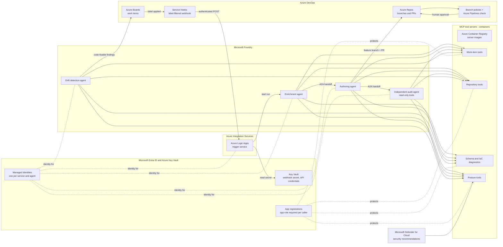

# Platform Map: How It Runs on Azure, and the AWS and Google Cloud Equivalents

This system is built and runs in production on **Microsoft Azure**. The earlier documents describe *what* each stage does. This one describes *which Azure service does it*, and what the matching service would be on **AWS** and **Google Cloud**.

How to read the tables below: every Azure service is shown with its **parent platform** (the product family it belongs to) in parentheses, for example `Service Hooks (Azure DevOps)`. The AWS and Google Cloud columns follow the same format, so each row reads left to right as "this job, on this cloud, is done by this service, which lives in this platform."

## The Azure architecture at a glance

## One request, end to end, on Azure

1. **Azure Boards (Azure DevOps).** A person applies the automation label to a work item.
2. **Service Hooks (Azure DevOps).** A subscription filtered to that event and that label sends one authenticated HTTP POST. Nothing else in the project fires it.
3. **Azure Logic Apps.** The trigger service reads the expected secret from **Azure Key Vault** using its own **managed identity**, rejects any request without a matching secret, and acknowledges valid requests immediately.
4. **Azure Logic Apps.** It ignores events caused by the system's own automation account, classifies the request (defects go to a separate diagnostic flow), and starts a run in **Microsoft Foundry**.
5. **Microsoft Foundry: enrichment agent.** Through its MCP tools it reads the work item, searches **Azure Repos** for related templates, and looks up the official Azure resource schema and API version. It writes its findings back to the work item as a comment.
6. **Microsoft Foundry: authoring agent.** It receives an A2A handoff, writes **Bicep** on a new feature branch in **Azure Repos**, validates the draft, and opens a pull request linked to the work item.
7. **Microsoft Foundry: independent audit agent.** It receives an A2A handoff and reads the changed files directly from the branch. Its tool server has no write capability. Blocking findings go back to the authoring agent.
8. **Branch policies (Azure DevOps).** The pull request cannot merge until the automated build validation in **Azure Pipelines** passes and a human reviewer approves.
9. **Azure Logic Apps.** The trigger service polls the Foundry run with a hard timeout, then independently confirms the automation label was removed from the work item.
10. **Microsoft Defender for Cloud (post-deployment).** The drift detection agent reads Defender for Cloud recommendations, classifies each as code-fixable or manual, and creates structured work items in a dedicated **Azure DevOps** project for human follow-up.

## Component map: Azure and its equivalents

| Component | Azure (built and running) | AWS equivalent | Google Cloud equivalent |
|---|---|---|---|
| Work tracking | Azure Boards (Azure DevOps) | No first-party equivalent: Jira or GitHub Issues | No first-party equivalent: Jira or GitHub Issues |
| Label-filtered webhook | Service Hooks (Azure DevOps) | Jira or GitHub webhook into Amazon API Gateway | Jira or GitHub webhook into a Cloud Run functions HTTP trigger |
| Source control and pull requests | Azure Repos (Azure DevOps) | GitHub or GitLab | GitHub or GitLab, or Secure Source Manager (Google Cloud) |
| Merge gate | Branch policies + Azure Pipelines build validation (Azure DevOps) | GitHub branch protection + GitHub Actions, or AWS CodeBuild (AWS Developer Tools) | GitHub branch protection + Cloud Build (Google Cloud CI/CD) |
| Trigger service | Azure Logic Apps (Azure Integration Services) | AWS Step Functions + AWS Lambda (AWS serverless) | Workflows + Cloud Run functions (Google Cloud serverless) |
| Secret storage | Azure Key Vault (Azure security) | AWS Secrets Manager (AWS security, identity, and compliance) | Secret Manager (Google Cloud security) |
| Service and agent identity | Managed identities (Microsoft Entra ID) | IAM roles (AWS IAM) | Service accounts (Google Cloud IAM) |
| Tool-server authorization | App registration with required app role assignment (Microsoft Entra ID) | IAM-authorized endpoint with an explicit invoke grant per role (AWS IAM), or Amazon Cognito | Cloud Run invoker role granted per service account (Google Cloud IAM) |
| Agent hosting and A2A handoff | Foundry Agent Service (Microsoft Foundry) | Amazon Bedrock AgentCore (Amazon Bedrock) | Vertex AI Agent Engine (Vertex AI) |
| AI models | Foundry Models (Microsoft Foundry) | Foundation models (Amazon Bedrock) | Model Garden (Vertex AI) |
| MCP server images | Azure Container Registry | Amazon ECR | Artifact Registry |
| MCP server runtime | Container hosting, such as Azure Container Apps | Amazon ECS on Fargate, or AgentCore Runtime (Amazon Bedrock) | Cloud Run |
| Resource schema lookup | Azure resource provider schemas (Azure Resource Manager) | Resource type schemas (AWS CloudFormation registry) | API Discovery Service, or Terraform provider schemas |
| Infrastructure as code | Bicep (Azure Resource Manager) | AWS CloudFormation, AWS CDK, or Terraform | Terraform, or Infrastructure Manager (Google Cloud) |
| Posture findings for drift | Microsoft Defender for Cloud | AWS Security Hub | Security Command Center |
| Run history and tracing | Logic Apps run history + Foundry tracing (Azure Monitor / Application Insights) | Step Functions execution history + Amazon CloudWatch / AWS X-Ray | Workflows execution logs + Cloud Logging / Cloud Trace |
| Tenant and account boundary | Entra tenant, management groups, subscriptions | AWS Organizations, organizational units, accounts | Organization, folders, projects |

## Layer by layer

### Work intake and trigger

- **Azure:** Azure Boards holds the request. A Service Hooks subscription, filtered to one event and one label, is the only path into the pipeline.
- **AWS / Google Cloud:** neither has a first-party work-tracking board. Use Jira or GitHub Issues, and point their webhook at an authenticated HTTPS endpoint (Amazon API Gateway on AWS, a Cloud Run functions HTTP trigger on Google Cloud).
- **Keep when porting:** filter at the source (event + label), validate a shared secret before any logic runs, and acknowledge immediately.

### Trigger service

- **Azure:** Azure Logic Apps validates the secret, skips the system's own activity, routes by request type, starts the agent run, polls with a hard timeout, and independently verifies the label was removed.
- **AWS:** AWS Step Functions for the workflow, with AWS Lambda for the individual checks and API calls.
- **Google Cloud:** Workflows, with Cloud Run functions for the individual checks and API calls.
- **Keep when porting:** the self-trigger guard and the independent completion check. Both prevent the same request from being processed repeatedly.

### Agent platform

- **Azure:** Microsoft Foundry hosts each agent as a configuration (model + instructions + bound tools) and handles the A2A handoff between them. Different models are used for different tasks rather than one model for everything.
- **AWS:** Amazon Bedrock AgentCore hosts agents and MCP servers, with models from Amazon Bedrock.
- **Google Cloud:** Vertex AI Agent Engine hosts agents, with models from Vertex AI Model Garden.
- **Keep when porting:** MCP and A2A are open protocols, so the agent instructions in [`agents/`](../agents) and the handoff contracts carry over unchanged.

### Tool layer (MCP servers)

- **Azure:** each tool area (work items, repository, schema and IaC diagnostics, posture findings) is its own container image in Azure Container Registry, running as its own service. The post-deployment tools run on a separate server from the pre-deployment tools.
- **AWS:** images in Amazon ECR, running on Amazon ECS with Fargate or on AgentCore Runtime.
- **Google Cloud:** images in Artifact Registry, running on Cloud Run.
- **Keep when porting:** the audit agent's tool server must not implement any write operation. That is what makes the audit read-only in fact, not just by instruction.

### Identity and secrets

- **Azure:** every service and agent has its own system-assigned managed identity. Tool servers are protected by an Entra app registration that requires an explicit app role assignment, so a valid token alone is not enough. Credentials for non-Azure APIs live in Key Vault.
- **AWS:** an IAM role per service and agent, endpoints that require an explicit invoke permission per role, and AWS Secrets Manager.
- **Google Cloud:** a service account per service and agent, the Cloud Run invoker role granted only to the callers that need it, and Secret Manager.
- **Keep when porting:** one identity per component, no shared or long-lived keys, and authorization granted per caller, not per tenant.

### Posture and drift

- **Azure:** the drift detection agent evaluates Microsoft Defender for Cloud recommendations, classifies each finding as code-fixable or manual, and writes structured work items with a suggested IaC fix into a dedicated Azure DevOps project.
- **AWS:** AWS Security Hub findings.
- **Google Cloud:** Security Command Center findings.
- **Keep when porting:** drift fixes go through the same human-reviewed pull request process as every other change. There is no faster side path.

### Merge gate

- **Azure:** Azure Repos branch policies require a passing Azure Pipelines build validation and a human reviewer before merge. No agent has a tool that can approve or merge.
- **AWS / Google Cloud:** GitHub or GitLab branch protection with required status checks and required reviewers, with the check run by GitHub Actions, AWS CodeBuild, or Cloud Build.

### Run history and tracing

- **Azure:** two independent records exist for every run: the Logic Apps run history (trigger, secret check, classification, routing) and the Foundry trace (each agent's tool calls and outputs). Because they are separate systems, their timestamps can be compared to confirm what actually happened, rather than relying on an agent's own summary. Transient tool errors appear in the trace as automatic retries, not silent gaps.
- **AWS:** Step Functions execution history plus CloudWatch and X-Ray traces.
- **Google Cloud:** Workflows execution logs plus Cloud Logging and Cloud Trace.

## What stays the same on every cloud

- The six stages and their boundaries: trigger, enrichment, authoring, independent audit, human-gated merge, drift detection.
- MCP for tools and A2A for handoffs. Both are open, vendor-neutral protocols.
- The audit agent's read-only tool server and the human approval required before merge.
- Organization-specific security rules supplied as parameters, so one pipeline serves many tenants and subscriptions without code changes.
- Work-item and PR content treated as data, never as instructions.

Porting the pattern means replacing the services in the component map, not redesigning the pipeline. The Azure implementation in [`infra/`](../infra) is the starting point.
